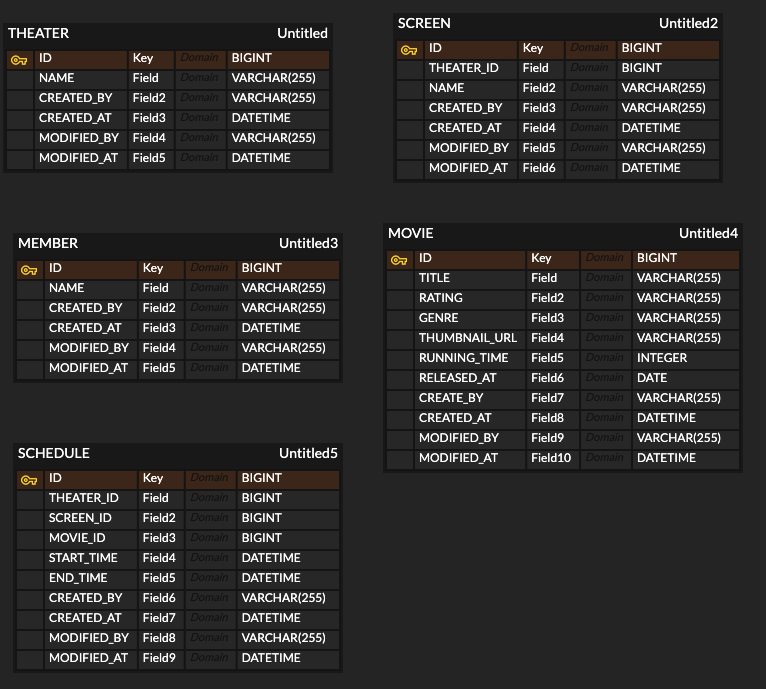

## [1주차] 멀티 모듈 및 Layered Architecture

## ERD

### 테이블 설계

- 모든 테이블이 `테이블 설계 시 작성자,작성일,수정자,수정일 컬럼을 모든 테이블에 꼭 반영해주세요.` 조건을 만족하게 하기 위해 BaseEntity 상속
- N+1 문제를 피하기 위하여 외래키 사용 X (참조 문제가 중요하지 않을 것이라 판단.)

## 멀티 모듈 설계

- presentation : 사용자의 요청과 응답을 처리하는 모듈
- application : 실제 비즈니스 로직이 동작하는 모듈
- infrastructures : DB, Redis 등 실질적인 외부 구성과 연결하는 모듈

