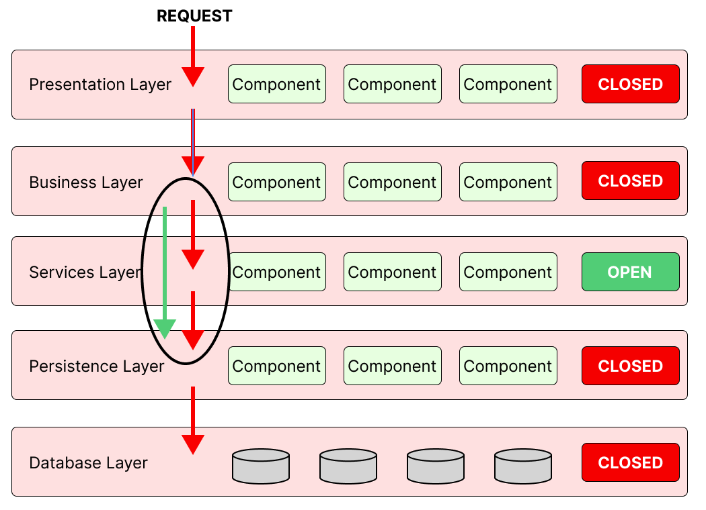
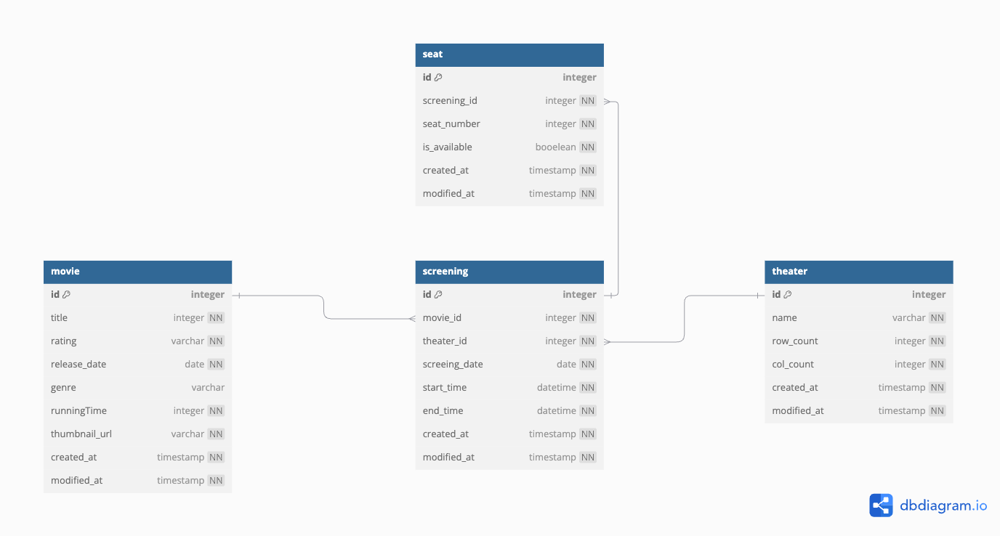

# 항해 시네마  

## 1. 멀티 모듈 설계
```
cinema-root/
├── cinema-domain/        
├── cinema-core/          
├── cinema-persistence/   
├── cinema-api/           
└── cinema-common/        
```

## 아키텍처 선정
레이어드 아키텍처 기반으로 멀티 모듈을 설계하였습니다.
```
    - cinema-domain: 도메인 모델 정의
    - cinema-persistence: 데이터 접근 처리
    - cinema-core: 비즈니스 로직
    - cinema-api: 외부 API 제공
    - cinema-common: 공통 유틸리티 및 설정
```

복잡도가 낮고 비용 면에서도 효율적인 아키텍처 스타일로 판단하여 선택하게 되었습니다. 도메인 중심 설계를 제공하는 클린 아키텍처와 헥사고날 아키텍처도 검토해볼 예정입니다.

## 테이블 설계

