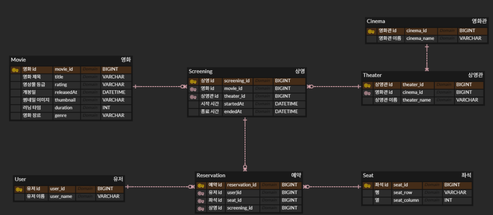

# Redis_project

커머스의 핵심 프로세스인 상품 조회 및 주문 과정에서 발생할 수 있는 동시성 이슈 해결 및 성능 개선을 경험하고, 안정성을 높이기 위한 방법을 배웁니다.

## Multi Module Design

 

**의존 관계**

- presentation -> application
- application -> domain, infrastructure
- infrastructure -> domain

 

**모듈별 역할**

- presentation 모듈
    - controller 역할
    - 요청을 받음
    - application 모듈의 service에 필요한 로직 호출
    - application 모듈의 service로부터 받은 결과를 응답

- application 모듈
    - service 역할
    - 필요한 비즈니스 로직 수행

- domain 모듈
    - 도메인 클래스들 모인 곳
    - 도메인 클래스의 로직 담당

- infrastructure 모듈
    - repository 역할
    - DB와 관련된 것 (entity, repository)가 존재
    - entity to domain 해주는 mapper 존재
    - application과 infrastructure간 중간 역할인 adapter 존재

 

## Table Design

**ERD**

 

**테이블 간 관계**

- Movie 테이블 - Screening 테이블 = 1 : N
- Screening 테이블 - Theater 테이블 = 1 : N
- Cinema 테이블 - Theater 테이블 = 1 : N
- Screening 테이블 - Reservation 테이블 = 1 : N
- User 테이블 - Reservation 테이블 = 1 : N
- Seat 테이블 - Reservation 테이블 = 1: N

  

Movie와 Theater가 N : M 이라고 판단

따라서 중간 테이블인 Screening 테이블 생성

Theater와 Seat이 가지고 있던 연관 관계 삭제

왜냐하면 연관 관계 가지고 있다면 하나의 예약에서 Seat 예약 시 다른 상영에서 해당 Seat 예약 할 수 없게 됨

Seat은 Reservation에서 가지고 있는 가상의 좌석이라고 생각

Seat의 지정된 범위만 (5*5) 넘지 않고 같은 상영에서 같은 Seat 예약 할 수 없도록

 

## Architecture

- Layered Architecture 적용
    - 따라서 presentation, application, domain, infrastructure 모듈로 구성
    - 상위 모듈만이 하위 모듈을 사용할 수 있도록 함

 

## 성능 테스트 보고서

링크 : [캐시 성능 테스트 보고서](https://cj-1998.notion.site/1be173b71de2801ca6faeb654507de83)

링크 : [예약 API 성능 테스트 보고서](https://cj-1998.notion.site/1c2173b71de280d9a3cde32e4563d9dd?pvs=73)

 

## Lock에 설정한 시간 설명

lease time : 4s

이유 : 예약 API 요청 시 평균적으로 1500ms = 1.5s 걸려서 여유를 주고 4s로 설정

wait time : 3s

이유 : '사용자가 기다릴 수 있는 최대 허용 시간' 이라는 원칙으로 3s로 설정