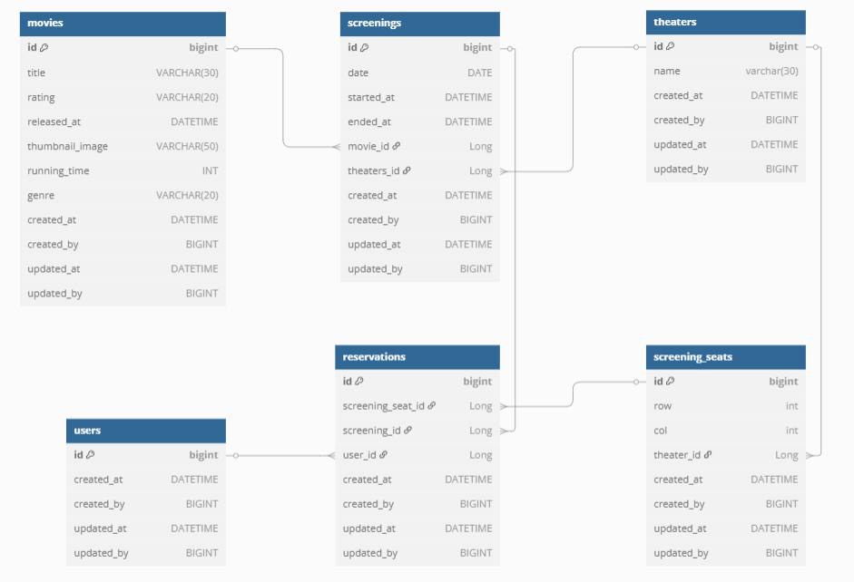

# Redis_project  

## ERD


## Multi Module 구조
Layered Architecture  패턴을 적용하여 설계.

```
├── api 
│       └── com.example.api
│           └── controller
│           └── common    # GlobalExceptionHandler   
│           └── dto
│           └── application    # SpringBootApplication    
│           
├── domain
│       └── com.example.domain
│           └── common    # 락과 AOP 로직
│           └── config    # Async 설정
│           └── dto
│           └── service
│
├── common
│       └── com.example.common   
│           └── config    
│           └── exception
│           
├── infra    # MySQL, Redis 등 외부 서비스 연동
        └── com.example.infra
            └── config
            └── entity
            └── enums
            └── repository
```


