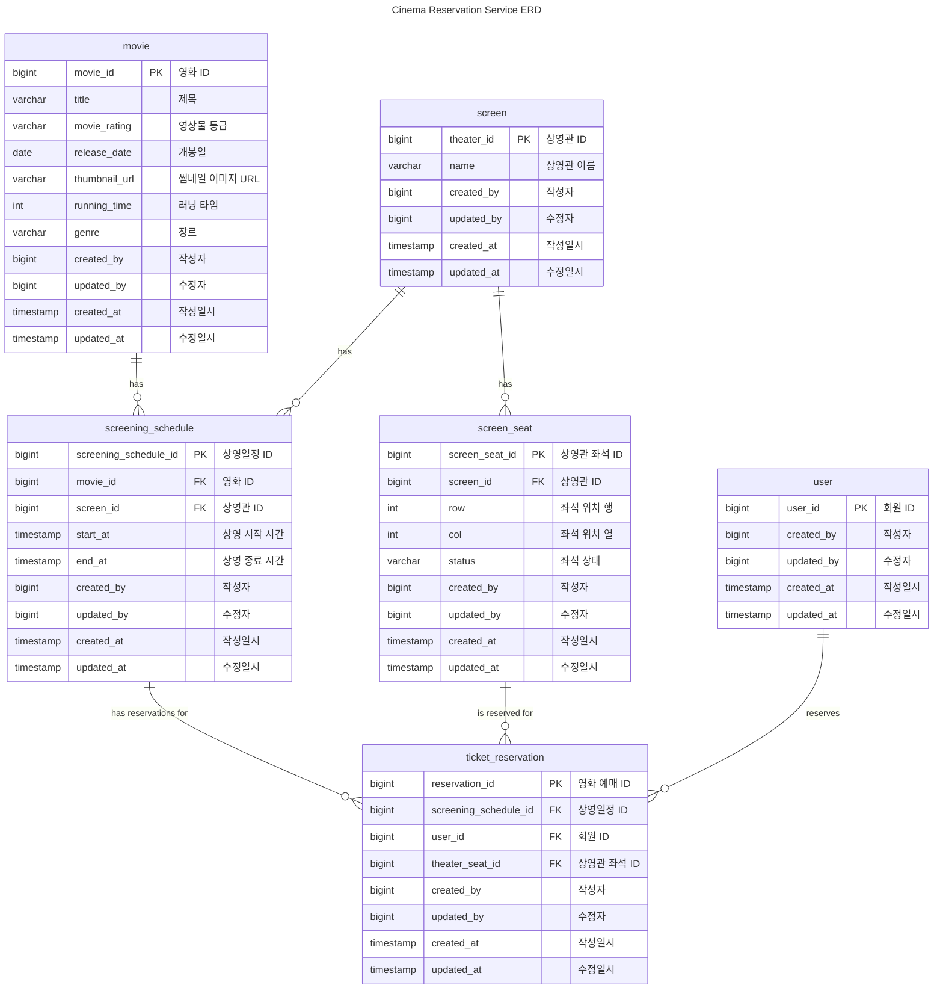

```mermaid
---
title: Cinema Reservation Service ERD
---
erDiagram
		movie ||--o{ screening_schedule : has
		screen ||--o{ screen_seat : has
		screen ||--o{ screening_schedule : has
		screening_schedule ||--o{ ticket_reservation : "has reservations for"
		screen_seat ||--o{ ticket_reservation : "is reserved for"
		user ||--o{ ticket_reservation : reserves

		movie {
				bigint movie_id PK "영화 ID"
				varchar title "제목"
				varchar movie_rating "영상물 등급"
				date release_date "개봉일"
				varchar thumbnail_url "썸네일 이미지 URL"
				int running_time "러닝 타임"
				varchar genre "장르"
				bigint created_by "작성자"
				bigint updated_by "수정자"
				timestamp created_at "작성일시"
				timestamp updated_at "수정일시"
		}
		screen {
				bigint theater_id PK "상영관 ID"
				varchar name "상영관 이름"
				bigint created_by "작성자"
				bigint updated_by "수정자"
				timestamp created_at "작성일시"
				timestamp updated_at "수정일시"
		}
		screening_schedule {
				bigint screening_schedule_id PK "상영일정 ID"
				bigint movie_id FK "영화 ID"
				bigint screen_id FK "상영관 ID"
				timestamp start_at "상영 시작 시간"
				timestamp end_at "상영 종료 시간"
				bigint created_by "작성자"
				bigint updated_by "수정자"
				timestamp created_at "작성일시"
				timestamp updated_at "수정일시"
		}
		screen_seat {
				bigint screen_seat_id PK "상영관 좌석 ID"
				bigint screen_id FK "상영관 ID"
				int row "좌석 위치 행"
				int col "좌석 위치 열"
				varchar status "좌석 상태"
				bigint created_by "작성자"
				bigint updated_by "수정자"
				timestamp created_at "작성일시"
				timestamp updated_at "수정일시"
		}
		ticket_reservation {
				bigint reservation_id PK "영화 예매 ID"
				bigint screening_schedule_id FK "상영일정 ID"
				bigint user_id FK "회원 ID"
				bigint theater_seat_id FK "상영관 좌석 ID"
				bigint created_by "작성자"
				bigint updated_by "수정자"
				timestamp created_at "작성일시"
				timestamp updated_at "수정일시"
		}
		user {
				bigint user_id PK "회원 ID"
				bigint created_by "작성자"
				bigint updated_by "수정자"
				timestamp created_at "작성일시"
				timestamp updated_at "수정일시"
		}
```